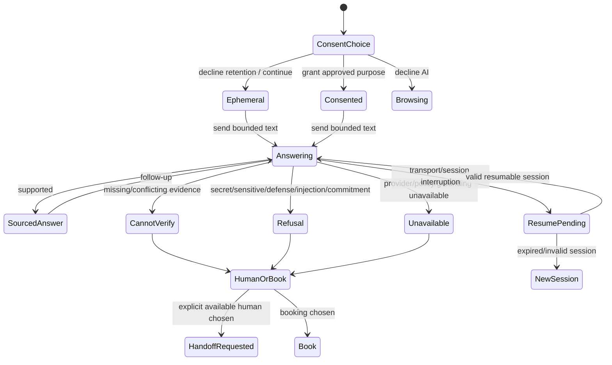
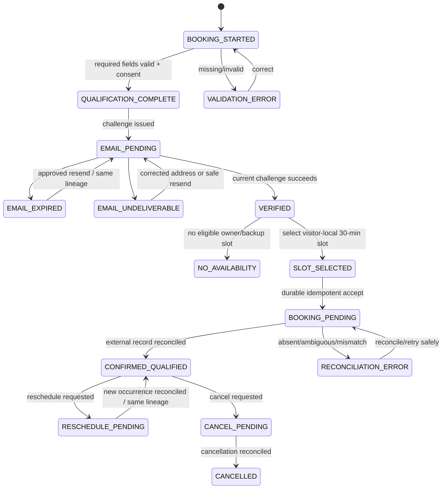
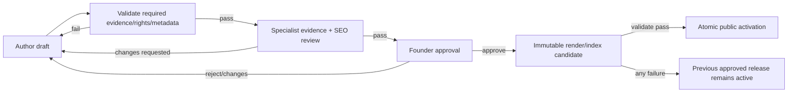

# Detailed Task Flows

## Flow notation

Each flow records trigger, precondition, states, alternate/error behavior, and
recovery. **[APPROVED]** states repeat accepted requirements; **[PROPOSED UX]**
details are reversible interaction specifications; **[UNRESOLVED GATE]** items
require founder/specialist approval and cannot be implemented by inference.

## AF-01 — Anonymous Reception AI Concierge

**Requirements:** FR-008, AI-001–AI-009, DATA-003–DATA-007.  
**Precondition:** active approved publication/grounding checksum; no account.

1. **[PROPOSED UX]** AI entry identifies “Reception AI Concierge,” explains that
   it uses approved sources, cannot bind price/scope/timeline/legal/delivery, and
   offers direct Book and Contact before input.
2. **[UNRESOLVED GATE]** Exact consent text, lawful basis, data controller/contact,
   consent-proof retention, and granular purposes await MA-002. UX reserves an
   unbundled, unchecked choice and cannot substitute final wording.
3. **[APPROVED]** Declining retention allows ephemeral chat; it never creates a
   retained brief/lead and never blocks public browsing or Book.
4. **[APPROVED]** Supported substantive answers display accessible canonical
   sources and the active evidence/release context. Source activation opens the
   semantic document, not a canvas-only panel.
5. **[APPROVED]** Missing, conflicting, stale, or checksum-mismatched evidence
   produces “cannot verify” and Human/Book options; there is no unsourced filler.
6. **[APPROVED]** Requests for secrets, classified/controlled/defense content,
   hidden instructions, evidence bypass, fixed price, binding terms, timeline,
   scope, or delivery commitments receive a clear refusal plus safe alternatives.
7. **[PROPOSED UX]** Interruption preserves a non-sensitive session handle only
   under the approved session policy. Resume shows connecting, resumed, expired,
   or unavailable. It never silently replays a message or duplicates a handoff.
8. **[APPROVED]** Visitor conversation content never enters aggregate analytics
   or model training. No upload/account/voice/video is present in the AI entry.

Success: a sourced answer, deliberate handoff, or deliberate booking. Error:
grounding/provider/policy/transport failure. Recovery: retry only when safe,
open cited semantic content, start a new ephemeral session, choose explicitly
available human, Contact, or direct Book.

## AF-02 — Human handoff

**Requirements:** FR-009–FR-011, DATA-010.  
**[UNRESOLVED GATE]:** named owners/backups, mailbox, groups, Teams recipients,
availability policy, queue ownership, and any response promise await MA-003/MA-006.

1. System offers live handoff only when a staff member has explicitly declared
   availability. Teams presence may change “available” to “unavailable,” never the
   reverse.
2. Visitor sees what approved conversation/brief data would be shared and provides
   purpose-specific consent where required. Decline returns to text AI/public
   content/Book without penalty.
3. A durable handoff request is created in the Hengshi console with one idempotency
   identity; Teams is an alert only.
4. States: `requested -> queued -> accepted -> text_active -> ended`; alternates
   `staff_unavailable`, `request_pending`, `alert_failed`, `expired`, `declined`.
5. Voice/video is offered only after a separate visitor opt-in. Decline, missing
   permission, unsupported device, or media failure leaves text and Book usable.
   If live synchronized media is offered, live captions are available. Prerecorded
   synchronized media has captions and satisfies SC 1.2.3's applicable audio-
   description/media-alternative branch. In addition, every applicable prerecorded
   video item in synchronized media has SC 1.2.5 audio description at the AA target.
   A complete media alternative may supplement that description or satisfy SC 1.2.3
   where applicable, but cannot replace required SC 1.2.5 audio description.
   Standards-supported non-applicability is recorded per item. Audio-only content
   has a transcript. Media without its required alternative remains held.
6. Alert failure retries independently and never deletes/duplicates the durable
   handoff. If acceptance becomes unavailable, show honest status and Book/Contact.

Success: accepted human text session or deliberate Book. Error: availability
changes, consent failure, duplicate request, console outage, alert failure, media
permission/failure. Recovery: resume durable request, retry alert operationally,
continue text, or choose Book; no response SLA is invented.

## BF-01 — Direct qualified booking

**Requirements:** BR-001, FR-004–FR-007, FR-019, DATA-010.  
**Precondition:** none beyond access to semantic `/book`; AI and human help are not
required. **[UNRESOLVED GATE]:** exact consent copy, challenge expiry/resend/rate
limits, provider, mailbox/calendar policy, owner/backup selection, no-slot policy,
reschedule/cancel authorization, and record-class retention await MA-002/MA-006.

### BF-01A Qualification

Fields are exactly: syntactically valid email, organization, role, desired outcome,
matched wing, and desired timing: exactly six required data fields. One separate
purpose-specific consent record makes seven required elements total. Budget is
optional.
**[PROPOSED UX]** A route-context wing may be suggested visibly but requires
visitor confirmation and can be changed without penalty. There is no scoring,
hidden assignment, name/phone/upload/account requirement, or fixed-price branch.

Applicable input-purpose mapping is explicit: email uses the recognized `email`
autocomplete purpose; organization uses `organization`; role uses
`organization-title` when the visible meaning is job title. Desired outcome,
matched wing, and desired timing use labeled domain controls because no applicable
WCAG input-purpose token is inferred. Optional budget receives a token only if the
later field meaning exactly matches a standardized purpose. Unsupported tokens are
not invented merely to satisfy a presence check.

Within one lineage, qualification values already supplied are auto-populated or
selectable at review, corrected-email, availability, reschedule, and cancellation
steps; the visitor is not required to re-enter them unless a documented WCAG 3.3.7
exception applies. The review step permits correction and confirmation before a
data-changing submission.

Validation runs on submit and, where helpful, after field interaction. An error
summary links to each field, errors remain associated in text, and valid values are
preserved only under the approved privacy contract. Invalid qualification creates
no retained lead and issues no email challenge. Declining consent returns to
browsing/ephemeral help without retained booking data.

### BF-01B Email ownership

Challenge issuance creates `EMAIL_PENDING`, never verified/slot-eligible/booked.
Pending presents a masked destination only if the privacy/security contract allows
it, plus change-address/resend actions whose timing is not invented here. Expired,
undeliverable, corrected-address, resend, and verified outcomes retain one lineage
and audit context. Only a successful current challenge reaches `VERIFIED`.

Failure/recovery: issuance timeout shows not-issued/unknown truthfully and checks
status before retry; expired allows approved resend; undeliverable allows a
corrected syntactically valid address or safe retry; abuse/rate limit shows bounded
guidance defined later, without revealing account existence or exact controls.
The selected verification method must satisfy accessible authentication: no
unaided memorization/transcription, puzzle, or cognitive-function test is required;
paste and assistive mechanisms remain enabled, or an equivalent accessible method
is provided. Exact challenge/provider design remains gated by MA-006 and security/
architecture review.

### BF-01C Availability and slot selection

Availability appears only after verification, in visitor-local time with timezone
label and daylight-saving-safe date/time. Only eligible approved owner/backup
availability is shown. There is no “live” owner claim from Teams presence.

Empty/no slot shows honest unavailability with refresh/later period and an approved
human/Contact route; no callback or response time is promised. Loading preserves
verification and does not show stale slots as available. On selection, a review
step restates local date/time/timezone, duration, organization/role/outcome summary,
wing, consent purpose, and editable fields before durable submission.

### BF-01D Idempotent booking and reconciliation

Submit uses one lineage and idempotency key. The first durable local acceptance
enters `BOOKING_PENDING`; duplicate clicks/reloads return the same result. Provider
timeout/ambiguous response remains pending and must reconcile before external retry.
Confirmation appears only when exactly one approved calendar/meeting record and
the local state agree. Alert failure does not undo a confirmed booking and retries
separately.

Confirmation contains the reconciled 30-minute local time, truthful next steps,
and reschedule/cancel controls only if the approved provider/authorization contract
supports them. It does not claim attendance, delivery acceptance, or a response SLA.

### BF-01E Reschedule and cancellation

**[PROPOSED UX]** These flows preserve the original lineage. Reschedule shows
current occurrence, verifies session/authorization, selects an eligible replacement,
enters `RESCHEDULE_PENDING`, and confirms only after old/new external state
reconciles. Cancel requires an explicit review, enters `CANCEL_PENDING`, and reports
cancelled only after reconciliation. Offline, expired session, provider timeout,
or conflicting state preserves the last confirmed truth and offers status refresh
or approved support. Exact link lifetime, identity proof, cutoff, and provider rules
are **[UNRESOLVED GATE]** and must not be inferred.

Previously supplied qualification and booking information is displayed/selectable
rather than required again. Reauthentication supports paste, password managers,
and assistive mechanisms or an equivalent accessible method without an unaided
cognitive test. Expiry preserves the last authoritative booking state and entered
non-sensitive work where approved, then returns focus to the reauthenticated step.

## DF-01 — Search, directory, and immersive HUD

**Requirements:** FR-001, FR-014, SEO-003, UX-003–UX-006.

1. Persistent directory opens from semantic header and immersive HUD with focus on
   a labeled search input; closing returns focus to invoker.
2. Search covers only active-release public titles, formal service names, wing,
   industry, evidence type, and approved summary text. It never searches drafts,
   session/chat, defense, or private/admin data.
3. Results display title, type, context, evidence/availability state, and canonical
   destination. Immersive location is optional; canonical destination is primary.
4. No query parameter is approved; **[PROPOSED UX]** search state is session-local
   and not persisted. Result URLs are clean canonicals. Analytics records only a
   privacy-approved bounded query class/no-result aggregate, never raw query text.
5. Empty query presents browse-by-wing/type; no results offers clear/reset, browse
   services/industries, Contact, and Book. Search-index unavailable falls back to
   static active-release directory; stale checksum blocks result activation.
6. Closed rooms are labeled unavailable and link to approved semantic content;
   they do not dead-end or imply launch readiness.
7. HUD controls: current location, directory/search, Quick Access, Book,
   accessibility, quality, audio, Exit. Quality downgrade never removes content;
   Exit transfers to current canonical route.

Success: canonical content opens with location context. Error: index loading,
empty/no result, offline, checksum mismatch, room closed, focus interruption.
Recovery: static directory, clear/browse, nearest semantic route, Quick Access.

## PF-01 — Author, reviewer, founder release flow

**Requirements:** PUB-001–PUB-007, SEC-001–SEC-005.  
**[UNRESOLVED GATE]:** named role/group membership, reassignment/escalation policy,
review SLA, exact rejection taxonomy, and legal sign-off operations.

1. Author creates/edits draft with route intent, owner, evidence/claim references,
   rights/provenance, content type, metadata, relationships, and accessibility
   content needs. Draft markers are conspicuous and never public/retrieval content.
2. Submission validates completeness. Held claims, absent rights, missing owner,
   unsupported structured data, route collision, or absent alt/transcript decision
   returns a linked issue list; safe draft remains intact.
3. Specialist reviewer sees source/evidence status and cross-surface preview, then
   requests changes or records independent pass. Author cannot perform this action
   on their own material where separation is required.
4. Founder receives only specialist-passed candidates and approves, rejects, or
   requests changes. No admin role or frontend manipulation bypasses server rules.
5. Approval produces an immutable candidate checksum. Render/index validation
   covers semantic HTML, metadata, schema, sitemap/redirects, AI bundle, 3D panels,
   exclusions, and draft-marker absence.
6. Any render/index/activation failure leaves the previous approved release active,
   records resumable error state, and permits safe retry after correction/review.
7. Public activation is atomic; audit history names roles/actions without exposing
   secrets or private draft content. Rejected/superseded-unapproved content stays
   isolated from HTML, search notification, AI retrieval, and 3D.

### Staff session/permission branches

- Signed out -> verified Entra sign-in route; no draft detail in redirect/error.
- Missing/ambiguous role -> access denied; no default privilege.
- Idle/absolute expiry during edit -> preserve only approved local/durable draft
  behavior, require accessible reauthentication, and prevent duplicate submission.
  Reauthentication permits paste/password-manager/assistive operation or an
  equivalent and does not require unaided recall, transcription, or a puzzle.
- CSRF/session rotation failure -> no state change; reauthenticate/reload safely.
- Author attempts self-approval -> server-denied with return to review queue.
- Reviewer/founder conflict or stale candidate checksum -> block decision, refresh
  candidate, and require review of the current immutable version.
- Administrator changes assignment/configuration -> audited but never implies
  content approval; least privilege and exact operations await security/API design.

## SOF-01 — Staff operator information architecture and operations

**Requirements:** FR-009–FR-011, FR-016, DATA-010, SEC-001–SEC-005.  
**[PROPOSED UX]** The staff console groups Work queue, Availability, Conversations,
Assignments, Booking reconciliation, Evidence/SEO review, Knowledge release review,
and Audit. These are task destinations, not approved URLs or exact privileges.
**[UNRESOLVED GATE]** Named operators/owners/backups, groups, SLAs, provider policy,
escalation rules, decline/end reason taxonomy, and exact privileges remain MA-003,
MA-006, security, and architecture decisions. Missing/ambiguous role denies action.

| Flow ID / operation | Actor and entry point | Authoritative state | Permitted action | Success / pending / error / empty / recovery | Audit evidence and negative-role behavior |
|---|---|---|---|---|---|
| SOF-01A Availability on | Authorized live staff or approved delegate; Availability | Durable Hengshi availability record plus current eligibility; Teams presence can only suppress | Explicitly declare available for approved scope | Success: available after durable accept; pending: write uncertain shows not available; error: role/eligibility/Redis/Teams issue fails unavailable; empty: no approved scope; recovery: status-check/retry | Actor, scope, before/after, time, idempotency, suppression reason; unauthorized role denied; presence alone cannot act |
| SOF-01B Availability off | Same authorized actor/delegate; persistent availability control | Durable availability record | Withdraw availability immediately | Success: unavailable; pending/error displays unavailable fail-safe; empty: already off is idempotent; recovery: status-check/retry without reopening | Actor, before/after, affected queued work; unauthorized role denied; no frontend-only toggle |
| SOF-01C Queue triage | Authorized conversation operator; Work queue > Conversations | Durable handoff request with consent/purpose, status, assignment/version | Inspect minimum needed context; filter/sort locally; choose accept/decline/reassign only if authorized | Success: request opened/current; pending: queue refresh; error: stale/session/data unavailable; empty: truthful no requests; recovery: refresh current record | Read/access and decision audit without copying conversation into analytics; author/content/admin roles get no implied chat privilege |
| SOF-01D Accept governed text conversation | Authorized available operator; current request detail | Durable queued request and current assignment/consent | Accept once, creating active text ownership | Success: `text_active`; pending: ambiguous stays queued/accept-pending; error: already accepted/stale/consent invalid; recovery: reconcile current owner, never duplicate | Actor, request, consent version, assignment, before/after, idempotency; unavailable/unauthorized/non-assigned role denied |
| SOF-01E Decline governed text conversation | Authorized assigned operator; current request | Durable queued/assigned request | Decline using later-approved bounded reason and route for reassignment/closure | Success: declined state recorded; pending/error: request remains current; empty: already resolved; recovery: refresh/reassign under approved policy | Actor, reason code only when approved, before/after; cannot silently delete; unauthorized role denied |
| SOF-01F End governed text conversation | Authorized active operator; active conversation | Durable active conversation and consent/session state | End text conversation with truthful visitor status | Success: ended once; pending/error: remains active/ending until reconciled; recovery: status-check; visitor retains Book/Contact | Actor, time, state transition, retention class reference; cannot alter consent/retention or erase audit; unauthorized role denied |
| SOF-01G Alert failure recovery | Authorized operations role; Work queue > Alert exceptions | Durable handoff/booking is truth; alert attempt is derived/outbox state | Inspect failure and retry/cancel alert attempt under approved policy without changing handoff/booking truth | Success: alert delivered/closed; pending: retry scheduled; error: adapter unavailable; empty: no exceptions; recovery: retry/escalate per later policy | Attempt IDs, actor, bounded error class, before/after; Teams-only/admin role cannot invent handoff/booking success |
| SOF-01H Assignment/reassignment | Authorized assignment role; Assignments or current work item | Durable approved scope, current owner/backup, work-item version | Assign/reassign eligible owner/backup; never create an identity or availability claim | Success: one current assignment; pending/error/stale conflict blocks routing; empty: no approved eligible assignee; recovery: refresh/hold item | Actor, from/to approved role IDs, reason, version; self-assign or admin override denied unless explicitly permitted later |
| SOF-01I Booking reconciliation | Authorized booking operations role; Booking reconciliation | PostgreSQL lineage/outbox plus approved external provider observation | Compare states; reconcile a known match; request safe retry only after ambiguity resolves | Success: confirmed/failed/cancelled/rescheduled truthful state; pending: ambiguous; error: provider unavailable/mismatch; empty: no exceptions; recovery: refresh/escalate, preserve last truth | Actor, lineage, local/external references, idempotency, before/after; cannot verify email, invent slot, or confirm from alert/calendar UI alone |
| SOF-01J Booking exception handling | Authorized booking operations role; Booking exceptions | Durable duplicate/missing/mismatch/alert/no-slot exception | Resolve only via approved bounded operation or mark held/escalated | Success: invariant restored; pending/error remains visible; empty truthful; recovery: approved retry/escalation with no SLA | Actor, exception class, evidence, action/result; unauthorized role cannot delete duplicate evidence or hide unknown outcome |
| SOF-01K Evidence/SEO review | Independent evidence/SEO reviewer; Review queue | Immutable candidate, sources, claim/rights/route metadata, active authority | Pass or request changes; cannot edit-and-pass own material or activate release | Success: specialist pass/change request; pending/error/stale blocks decision; empty no candidates; recovery: refresh/current candidate | Reviewer, checksum, findings/disposition, sources; author/self-review/admin-as-reviewer denied |
| SOF-01L Knowledge release review | Authorized knowledge reviewer independent where required; Knowledge queue | Approved publication candidate and exact grounding bundle/checksum | Verify only approved public sources, refusals, exclusions, and checksum; pass/request changes | Success: knowledge-ready candidate; error on draft/private/defense/stale/missing source; empty truthful; recovery: return to author/release review | Reviewer, bundle/checksum, source inventory, negative cases; cannot publish/activate or bypass founder approval |
| SOF-01M Audit inspection | Authorized audit/privacy/security role; Audit | Append-only authoritative audit view with approved redaction | Search bounded IDs/time/action classes; inspect event chain; export only if later approved | Success: complete authorized view; pending/index unavailable falls back to durable retrieval; empty truthful; recovery: refine/retry/escalate integrity gap | Inspection itself audited; no secret/chat-content analytics; operators cannot edit/delete audit; unauthorized role denied without disclosing event existence |

### Operator flow invariants

1. Availability, assignment, handoff, booking, publication, knowledge, and audit
   each expose their own authoritative state; Redis, Teams, search, and alerts are
   derived and cannot overwrite durable truth.
2. Every mutating operator action is server-authorized, idempotent where repeated,
   version/checksum aware, and auditable. Pending/ambiguous never becomes success.
3. Queue empty is a valid state; queue unavailable is a distinct error. Decline,
   end, reassignment, reconciliation, and audit retention policy are not invented.
4. An administrator has no automatic author/reviewer/founder/chat/booking/audit
   authority. Negative-role behavior denies by default and records the event safely.
5. SEO review governs route/metadata/search evidence; knowledge review governs the
   exact approved grounding bundle. Neither can expose drafts or replace founder
   publication approval.

## CF-01 — Contact and unavailable-help flow

Contact presents verified channels only after MA-002/MA-006. Until then the UX
spec reserves channel purpose, consent/privacy explanation, validation, submitted,
pending, failed, duplicate, and offline states without populating an address or
promise. If live human/AI/booking integration is unavailable, Contact and semantic
content remain reachable, but no response time, owner, or delivery claim is shown.

## Edge-case register

| Case | Required outcome |
|---|---|
| Deep link to closed immersive room | Canonical page opens if active; room labeled closed; no dead end. |
| Retired saved location | 410/approved redirect behavior, then nearest canonical/Reception; stale preference cleared. |
| Active release changes mid-session | Preserve current safe interaction; block stale source/booking context where integrity matters; refresh with announcement. |
| Draft/rejected marker appears in public/search/AI | Fail closed, quarantine result, keep prior release, alert for investigation. |
| Back/refresh during form | No duplicate lineage/write; restore only approved safe state; disclose if sensitive draft cannot be restored. |
| Multiple tabs | One lineage/idempotency result; stale tab refreshes authoritative state. |
| Corrected email after challenge | Same lineage; old challenge invalid; no slot eligibility until new address verified. |
| Slot taken after selection | No confirmation; refresh availability under same verified lineage. |
| Calendar confirms after UI timeout | Reconciliation returns existing confirmed result; never create second event. |
| Cancellation races reschedule | Serialize/reconcile; show pending/conflict, retain last confirmed truth. |
| Local timezone changes | Re-render local time with explicit zone; confirmation remains same instant. |
| Screen reader status interruption | Queue concise status; focus stays controlled; full detail remains visible. |
| Offline after qualification but before durable accept | Explicit not submitted; no hidden retained record/local PII persistence. |
| Redis unavailable | Durable truth remains; rate/presence/search-derived behavior fails closed/degrades; no false availability. |
| Graph/Teams unavailable | Booking/handoff durable state preserved; pending/reconcile or alert retry; no false confirmation. |
| AI route cannot meet data policy | Refuse/unavailable; do not reroute PII/confidential data to unapproved provider. |
| Defense request | Refuse without revealing gated content; general services/Contact/Book only; secure route only after MA-011. |
